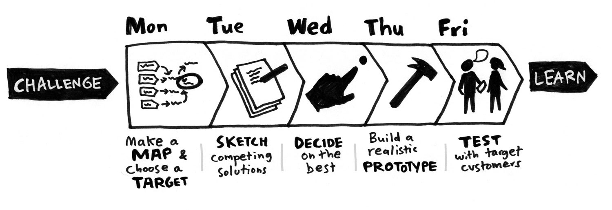

# DESIGN SPRINT

## Intro

Design Sprint is an agile methodology to conceive an idea in something tangible and testable.

The methodology uses five steps, which are divided exactly into five days

***

### Phase 1: Unpack

The first day of a Design Sprint is aimed at identifying and aligning the focus.

It is when a problem is raised as a priority. And all participants contribute their information about it - it can be a technical problem, a need for iteration, a product failure etc.

On the first day, the team applies techniques to carry out a survey of the scope of the project, discussing various topics and difficulties. We are **converging** to a single point of focus.

Techniques can also be performed, such as 5w2h and SWOT.

***

### Phase 2: Sketch

This phase is also similar to the traditional brainstorming, the difference being the focus on **divergence**.

Instead of the team getting together to play and debate ideas, each participant is encouraged to seek solutions to the problem separately.

Thus, the tendency is for everyone to analyze and solve the issue based on their professional background - without strings attached, without the fear of suggesting something.

Only when the deadline ends will all the proposed ideas be brought together.

On the second day, the group reaches a greater consensus on the theme defined for the project, each member is asked to make a draft in order to be able to make a final version, this draft can be a RichPicture.

***

### Phase 3: Decide

This is the most critical day of the Design Sprin.

You can't waste a lot of time debating all the proposed ideas.
The focus needs to be on predicting the return of each suggestion in relation to the problem presented.

And, of course, the feasibility of prototyping and testing the idea before the deadline.

***

### Phase 4: Prototype

Once the idea is chosen, it's time to put it into practice.

The purpose of a prototype is not to finish with a finished product (because it would be impossible in a day),

but a representation of the proposed solution with medium to high fidelity.

***

### Phase 5: Test

The last day of the week is reserved for testing, measuring, analyzing and learning from the designed prototype.

At the end of the day, it is still possible to improve what worked and discard what is not relevant.

***
